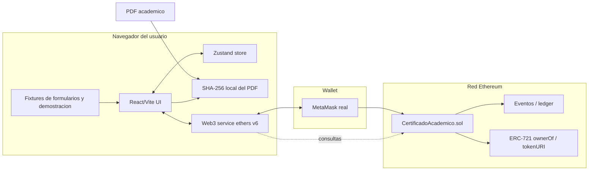
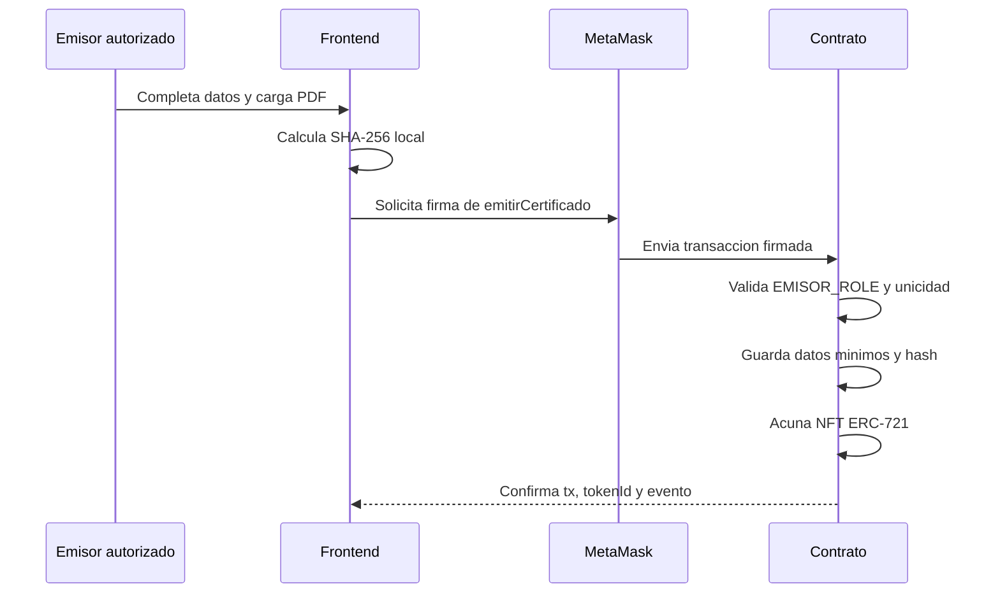
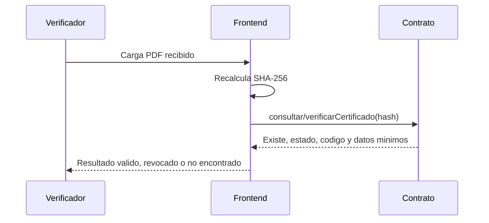
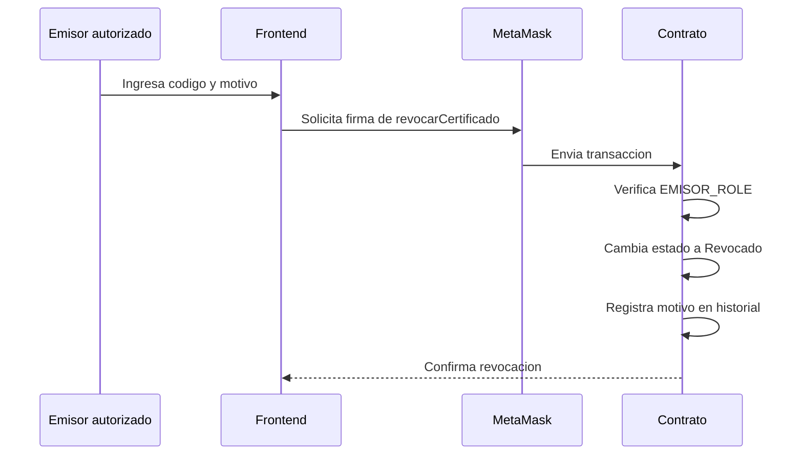

# Arquitectura - CertiChain Academico

Repositorio Git de entrega: `URL_DEL_REPOSITORIO_GIT`

## Vision general

CertiChain Academico esta organizado como una DApp sin backend propio. El navegador ejecuta la interfaz, calcula hashes de documentos, solicita firmas a MetaMask y consulta o modifica el contrato inteligente desplegado en Ethereum. La blockchain mantiene la verdad operacional: certificados, estados, roles, historial y referencias NFT.

## Diagrama de arquitectura

## Componentes principales

| Componente | Responsabilidad |
| --- | --- |
| `src/features/*` | Pantallas de dominio: emision, verificacion, revocacion, emisores, estudiantes, ledger, NFT y configuracion. |
| `src/store/app-store.ts` | Estado de interfaz y seleccion de rol/red. No reemplaza el estado on-chain. |
| `src/lib/hash.ts` | Calculo de SHA-256 para documentos PDF. |
| `src/lib/web3/service.ts` | Adaptador Web3 con `ethers` v6 para leer contrato y enviar transacciones. |
| `src/lib/web3/deployments.json` | Registro de direcciones desplegadas por red. |
| `src/lib/web3/contract-info.json` | ABI y datos del ultimo despliegue exportados por Hardhat. |
| `blockchain/contracts/CertificadoAcademico.sol` | Fuente de verdad de certificados, roles, historial, recepcion y NFT. |
| `blockchain/scripts/deploy.js` | Despliegue y exportacion de ABI/direccion al frontend. |

## Fuente de verdad

El contrato inteligente es la fuente de verdad operacional. Mantiene:

- certificados emitidos;
- hash SHA-256 de cada PDF;
- estado del certificado;
- emisor y estudiante asociado;
- fecha de emision, recepcion y revocacion;
- motivo de revocacion;
- historial de eventos;
- emisores autorizados;
- tokenId NFT y metadata.

Los fixtures del frontend son auxiliares para formularios, estados iniciales y demostracion. No son una base de datos y no sustituyen la informacion on-chain.

### Consulta institucional sin base de datos propia

La universidad emisora puede ver certificados y estado institucional leyendo el contrato:

- `listarCertificados` devuelve certificados registrados para poblar listados.
- `consultarPorCodigo` permite abrir el detalle de un certificado.
- `consultarHistorial` permite ver emision, recepcion, verificacion y revocacion.
- `listarEmisores` permite revisar wallets activas o desactivadas.
- Los eventos emitidos por Solidity pueden reconstruir el ledger para auditoria.

Por eso la DApp no necesita MySQL, MongoDB, Firebase ni un backend propio para cumplir la practica. Lo que si queda fuera de la blockchain es el archivo PDF original, que debe conservarse por la institucion, el estudiante o un almacenamiento externo. La blockchain conserva la huella SHA-256 y el estado verificable.

## Por que no hay base de datos ni backend

La practica busca demostrar una DApp Ethereum. Por ello:

- la confianza se deposita en el contrato, no en un servidor central;
- la verificacion puede hacerse consultando la red;
- el historial no depende de una tabla local;
- los permisos se aplican en Solidity mediante roles;
- las transacciones quedan firmadas por las wallets de los usuarios;
- el frontend puede ser servido como aplicacion estatica.

Un backend solo seria necesario en una version productiva para integraciones externas, custodia documental, indexacion avanzada o notificaciones. No es requerido para cumplir el flujo academico de emision y verificacion.

## Flujo de emision

## Flujo de verificacion por PDF

## Flujo de revocacion

## Modelo on-chain

`CertificadoAcademico.sol` define:

- `Certificado`: codigo, nombre del estudiante, carrera, tipo, hash, emisor, estado, fechas, estudiante, recepcion y tokenId.
- `EventoHistorial`: tipo de evento, actor, fecha y detalle.
- `EstadoCertificado`: `Inexistente`, `Valido`, `Revocado`.
- `EMISOR_ROLE`: rol requerido para emitir y revocar.
- `DEFAULT_ADMIN_ROLE`: rol requerido para gestionar emisores.

Tambien hereda de `ERC721URIStorage` para soportar NFT academico y de `AccessControl` para control de permisos.

## Redes y despliegues

| Red | ChainId | Clave en deployments | Observacion |
| --- | --- | --- | --- |
| Hardhat Local | `31337` | `hardhat` | Nodo local para pruebas rapidas. |
| Ganache Local | `1337` | `ganache` | Alternativa local con Ganache. |
| Sepolia | `11155111` | `sepolia` | Testnet publica con ETH de prueba. |

El script `blockchain/scripts/deploy.js` detecta la red y actualiza el registro de despliegues para que el frontend use la direccion correcta.

## Seguridad y costos

- Solo MetaMask firma transacciones de escritura.
- Las consultas de lectura no requieren gasto de gas.
- Las transacciones locales usan ETH de prueba generado por Hardhat o Ganache.
- Las transacciones en Sepolia consumen SepoliaETH de faucet.
- El contrato evita duplicidad de codigo y de hash.
- El PDF no se publica en la red; solo su huella criptografica.

## Checklist de entrega

- Repositorio Git: `URL_DEL_REPOSITORIO_GIT`
- Diagrama de arquitectura incluido.
- Flujo de emision documentado.
- Flujo de verificacion por PDF documentado.
- Flujo de revocacion documentado.
- Fuente de verdad on-chain explicada.
- Ausencia de backend/base de datos justificada.
- Capturas sugeridas preparadas.
- Comandos verificados por el desarrollador registrados en `docs/PRUEBAS_Y_DESPLIEGUE.md`.
